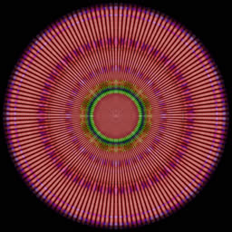
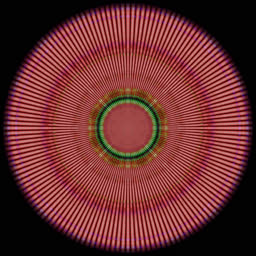
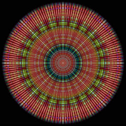
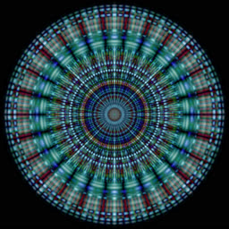
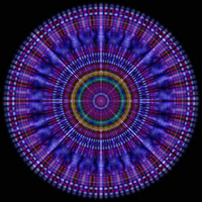
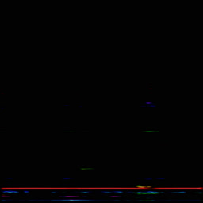
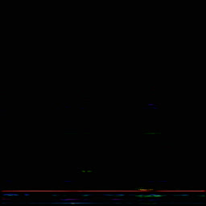
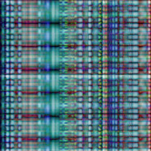

# The Lesser-Known Side of Discrete Cosine Transform

The 8 pictures below represent a [1 sec audio sample](1sec.ogg) (some singing bowl).

|  |  |  |  |
|--|--|--|--|
| k=8m+0, +5dB, 12%  | k=8m+1, +10dB, 21%  | k=8m+2, +12dB, 26%  | k=8m+3, +8dB, 16%  |
| k=8m+4, +2dB, 8%  | k=8m+5, -2dB, 5%  | k=8m+6, -1db, 6%  | k=8m+7, 0dB, 7%  |

First, the audio sample is decoded at 48 kHz, split into 2048 overlapping frames with 2048 samples each, each frame `X[0..N-1]` is analyzed with DCT: `Y[0..N-1] = DCT[X] = DFT[X[0..N-1],X[N-1..0]]`. The result is a more or less standard spectrogram. Colors correspond to the A-G notes.

From the DCT's point of view, each frame is a sum of `Y[k]*cos(2pi*k*t/N)` waves, where `Y[k]` are real amplitudes and `k` are frequencies (and `N=2048`). This is what happens when we select only `k=2m` or `k=8m+5` frequencies:

The spectrograms are rendered with dynamic range of 40 dB, meaning that amplitudes smaller than 1% of the max amplitude won't be visible. Displaying only `k=8m+5` frequencies reveals that there is a lot of relatively quiet sound there.

The last trick is squaring the amplitudes and applying the inverse DCT. The idea is that all the `k=8m+5` cosine waves can be combined back into a time-domain signal. This corresponds to convolving the original signal with a certain kernel. Each cosine wave is colored according to its frequency, so their sum appears quite colorful:

This procedure can be repeated for each remainder `k=8m+r`, `r=0..7`, producing 8 pictures. Cosine waves are symmetric (even), so they look better in polar coordinates, as shown above. The sum of squared amplitudes corresponds to weight of each picture, e.g. if the total sum `A[0]^2+...A[N-1]^2 = 1`, then `sum A[8m+2]^2 = 0.26`, so the third picture contributes 1/4 to the total.
